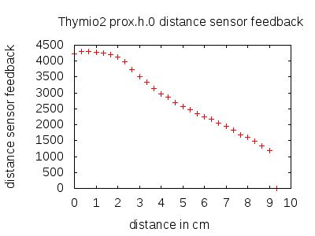
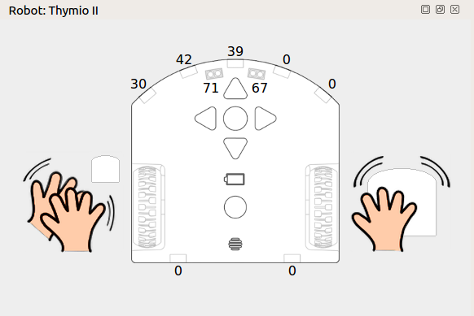
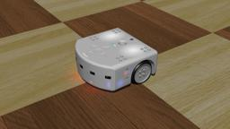
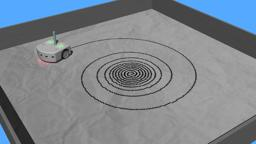
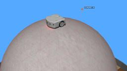

Thymio II is an affordable educational robot.
It provides three main features: a large number of sensors and actuators, an educative interactivity based on light and touch, a programming environment featuring graphical and text programming.

More information about the Thymio II is available from its official [website](https://aseba.wikidot.com/en:thymio).

Webots contains an accurate model of the Thymio II robot.
Almost all the Thymio II devices have been modeled and calibrated.
Finally several objects related to the Thymio II are available, including a pen which can draw on any 3D object.

### Thymio II Model

The main characteristics of the Thymio II model in Webots is summed up in this table:

%figure "Thymio II characteristics"

| Characteristics             | Values       |
| --------------------------- | ------------ |
| Length                      | 112 mm       |
| Width                       | 117 mm       |
| Height                      | 53 mm        |
| Weight                      | 0.25 kg      |
| Max. forward/backward speed | 0.2 m/s      |
| Max. rotation speed         | 9.53 rad/s   |

%end

The following table shows which devices are supported by the model, and their names (using the Webots terminology).

%figure "Thymio II devices"

| Device             | Support         | Webots name                                                                                                                               |
| ------------------ | --------------- | ----------------------------------------------------------------------------------------------------------------------------------------- |
| Motors             | Full support    | motor.[left-right]                                                                                                                        |
| RGB LEDs           | Full support    | leds.top, leds.bottom.[right-left]                                                                                                        |
| LEDs               | Full support    | leds.buttons.led[0-3], leds.circle.led[0-7], leds.prox.h.led[0-7], leds.prox.v.led[0-1], leds.sound, leds.rc, leds.temperature.[red-blue] |
| IR sensors         | Full support    | prox.horizontal.[0-6], prox.ground.[0-1]                                                                                                  |
| Accelerometer      | Full support    | acc                                                                                                                                       |
| Buttons            | Full support    | button.[forward-backward-left-right-center]                                                                                               |
| Microphone         | Clap event only | through the robot window                                                                                                                  |
| Speaker            | Not supported   | N/A                                                                                                                                       |
| Temperature sensor | Not supported   | N/A                                                                                                                                       |
| RC device          | Not supported   | N/A                                                                                                                                       |

%end

The Thymio II distance sensor feedback is given on the following figure.
The calibration was performed using a regular A4 white paper.

%figure "Proximity sensor response versus distance"



%end

### Thymio2 PROTO

Derived from [Robot](https://cyberbotics.com/doc/reference/robot).

```
Thymio2 {
  SFVec3f    translation     0 0 0
  SFRotation rotation        0 0 1 0
  SFString   name            "Thymio II"
  SFString   controller      "thymio2_demo"
  MFString   controllerArgs  []
  SFString   customData      ""
  SFBool     supervisor      FALSE
  SFBool     synchronization TRUE
  SFString   window          "<generic>"
  SFString   contactMaterial "thymio body"
  SFBool     castLight       TRUE
  MFNode     bodySlot        []
}
```

#### Thymio2 Field Summary

- `contactMaterial`: Defines the `contactMaterial` of the all the [Solid](https://cyberbotics.com/doc/reference/solid) nodes.

- `castLight`: Defines whether OpenGL lights are cerated for each LEDs.

- `bodySlot`: Extends the robot with new nodes in the body slot.

### Robot Window

To open the Thymio II window, select the "Show Robot Window" option in the robot [context menu](https://cyberbotics.com/doc/guide/the-3d-window#context-menu).

%figure "Thymio II robot window"



%end

### Samples

Various examples of the possible behaviors of the Thymio II are located here: "WEBOTS\_HOME/projects/robots/mobsya/thymio/worlds".
The various accessible worlds are described below.

#### thymio2.wbt

 An example of the possible behaviors of the Thymio II.

#### thymio2\_pen.wbt

 You can easily add a pen in the simulated model by adding a `Thymio2Pen` node to the `Thymio2::bodySlot` field.
This pen can draw on every 3D object.
This is particularly useful to perform [these exercises](https://aseba.wikidot.com/en:thymiodrawing).


#### thymio2\_ball.wbt

 [These exercises](https://aseba.wikidot.com/en:thymioballeinverse) can be reproduced by adding a `Thymio2Ball` node in your world.
The ball can be slightly moved by applying a force on it (`ALT + mouse left click`).
